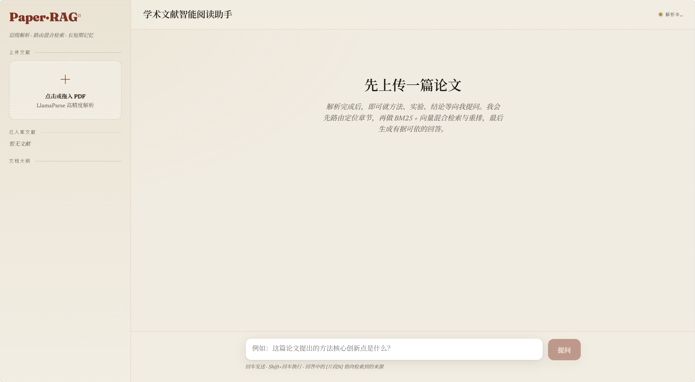

# Paper-RAG · 学术文献智能阅读助手

面向学术文献的**长文本、复杂逻辑**场景，基于 **FastAPI + LlamaIndex + Qwen** 构建。
通过「层级文档解析 + 支持动态路由的混合检索 + 长短期记忆」三大设计，为复杂论文的阅读与洞察提供高精度的智能辅助。


---

## ✨ 核心能力

| # | 能力 | 说明 | 落点 |
|---|------|------|------|
| 1 | 层级解析 + 父子分块 | LlamaParse 高精度解析 PDF，正则提取 Markdown 标题层级，按 Parent-Child 保留上下文 | `document_parsing.py` / `chunk_embedding.py` |
| 2 | 路由检索 (Routing) | 先在一级/二级标题节点中检索，定位高相关章节 | `hybrid_retrieval.py` |
| 3 | 查询改写 (QueryProcessor) | 结合多轮历史，将口语化提问重写为高精度学术检索词 | `llamaindex_rag.py` |
| 4 | 深度召回 (BM25 + Vector) | bge-m3 向量化，锁定章节后在范围内同时触发 BM25 与 Milvus 向量检索 | `hybrid_retrieval.py` |
| 5 | 融合与重排 (Rerank) | 加权融合 / RRF 合并，再以 bge-reranker-v2-m3 二次重排 | `hybrid_retrieval.py` |
| 6 | 上下文自愈 (Auto-Merge) | 命中子节点聚集于同一父节点时，自动回填为完整父节点内容 | `hybrid_retrieval.py` |

---

## 🗂 项目结构

```
paper-RAG/
├── app.py                # FastAPI 后端主服务（API & SSE 流式接口）
├── config.py             # 全局配置中心
├── document_parsing.py   # 文档解析（LlamaParse 接入、标题层级提取）
├── chunk_embedding.py    # 向量化与存储（父子分块、bge-m3、Milvus 封装）
├── hybrid_retrieval.py   # 混合检索核心（路由、BM25、RRF/加权融合、重排、Auto-Merge）
├── llamaindex_rag.py     # RAG 中枢（通义千问封装、查询改写、长短期记忆、流式编排）
├── evaluation.py         # 评估流水线（构建评估集、Hit Rate / MRR）
├── templates/index.html  # 交互式 Web UI
├── uploads/              # 用户上传的原始文献
├── output/               # 解析中间结果 + Milvus 主库文件
├── memory_storage/       # 长期记忆 Milvus 向量落盘
├── requirement.txt
└── README.md
```

---

## 🔧 检索流水线

```
用户提问
  └─ 查询改写：结合短期历史 + 长期记忆召回，消解指代 → 学术检索 query
      └─ 路由检索：在一/二级标题(路由)节点中定位 Top-K 章节
          └─ 深度召回（限定章节范围）
              ├─ BM25（字词频率）
              └─ Milvus 向量（bge-m3 语义）
              └─ 融合(RRF / 加权) → bge-reranker-v2-m3 重排 → Top-N
                    └─(6) Auto-Merge：子节点聚集同父 → 回填完整父节点
                          └─ qwen流式生成（标注 [片段N] 来源）
```

---

## 🚀 快速开始

### 1. 安装依赖
```bash
pip install -r requirement.txt
```

### 2. 配置密钥（环境变量）
```bash
export DASHSCOPE_API_KEY="sk-xxx"        # 通义千问
export LLAMA_CLOUD_API_KEY="llx-xxx"     # LlamaParse
# 可选：export EMBED_DEVICE=cuda          # 有 GPU 时加速嵌入/重排
```
> 首次运行会自动从 HuggingFace 下载 `BAAI/bge-m3` 与 `BAAI/bge-reranker-v2-m3`。
> 国内网络可设置 `export HF_ENDPOINT=https://hf-mirror.com` 加速。

### 3. 启动服务
```bash
python app.py        # 或 uvicorn app:app --port 8000
```
浏览器打开 `http://localhost:8000`，上传 PDF 后即可提问。

---

## 🧪 评估

入库至少一篇文献后：
```bash
python evaluation.py 30      # 采样 30 个片段自动构建评估集并计算指标
```
输出 `output/eval_metrics.json`，包含**检索**与**路由**两个层级的：
- `Hit Rate@k`：top-k 中至少命中 1 个相关结果的比例。
- `MRR`：首个相关结果排名倒数的平均值，\( \mathrm{MRR}=\dfrac{1}{N}\sum_{i=1}^{N}\dfrac{1}{\mathrm{rank}_i} \)。

---

## ⚙️ 可调参数（见 `config.py`）

| 参数 | 含义 | 默认 |
|------|------|------|
| `ROUTE_MAX_LEVEL` | 路由检索的标题层级上限（一/二级） | `2` |
| `ROUTE_TOP_K` | 路由命中章节数 | `3` |
| `FUSION_MODE` | 融合策略 `rrf` / `weighted` | `rrf` |
| `WEIGHT_BM25` / `WEIGHT_VECTOR` | 加权融合权重 | `0.4 / 0.6` |
| `RERANK_TOP_N` | 重排后保留片段数 | `5` |
| `AUTO_MERGE_RATIO` | 触发自愈合并的子节点占比阈值 | `0.5` |
| `SHORT_TERM_MAX_TURNS` | 短期记忆轮数 | `6` |
| `LONG_TERM_TOP_K` | 长期记忆召回条数 | `3` |

---

## 📝 备注
- **Milvus** 采用 Milvus Lite 本地文件模式，无需单独部署服务端；落盘于 `output/` 与 `memory_storage/`。
- **离线/缓存**：解析结果按 `doc_id` 缓存于 `output/*.md`，重复上传同一文件不会重复消耗 LlamaParse 额度。
- 若未安装 `FlagEmbedding`，系统会自动跳过重排（优雅降级），其余流程不受影响。
